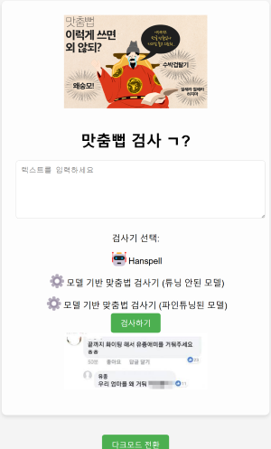
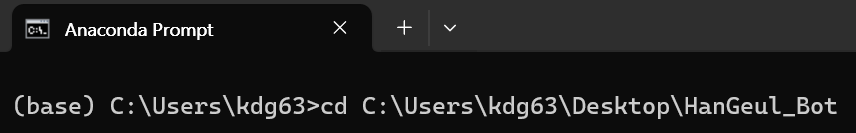
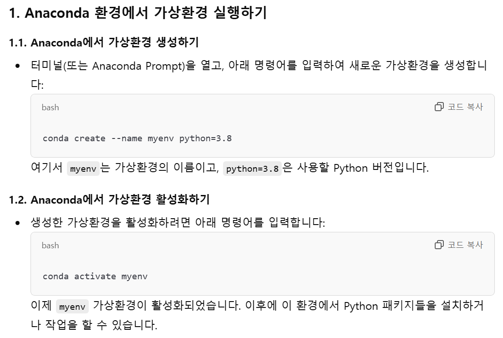
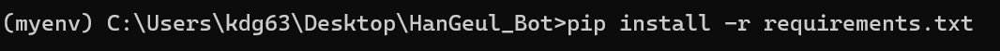
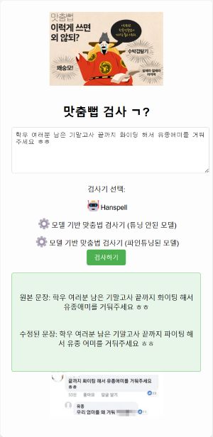
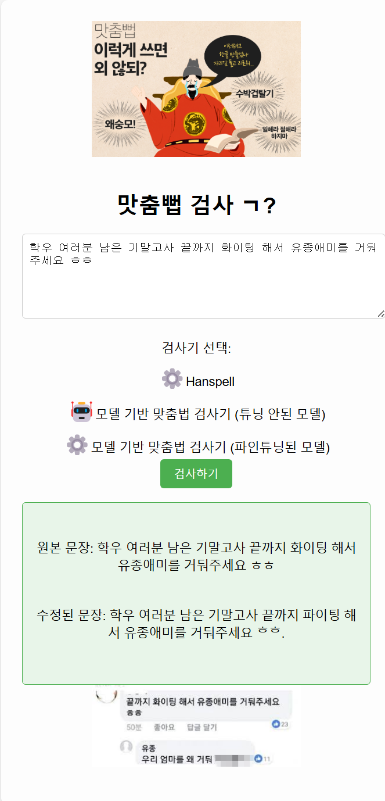
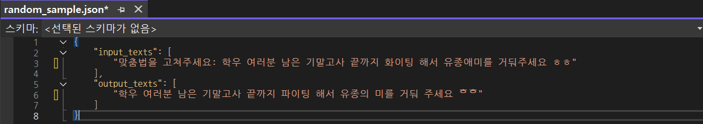
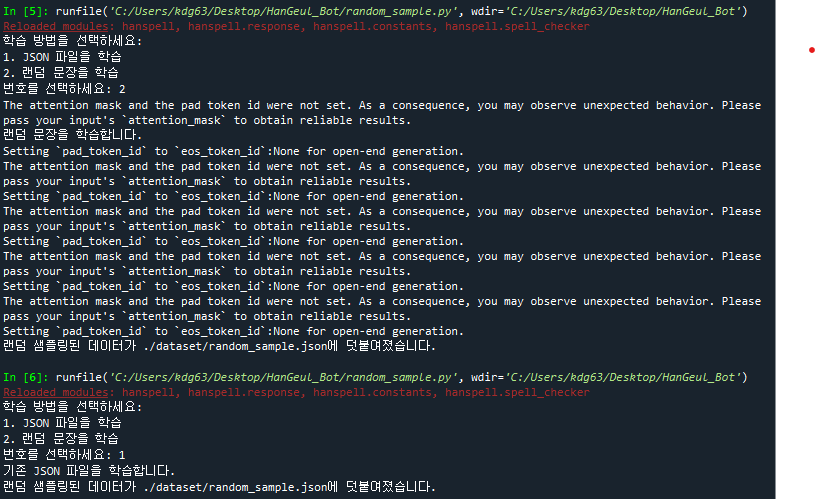
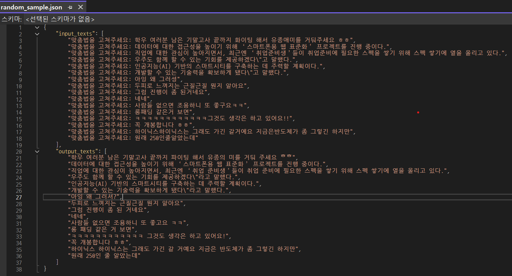
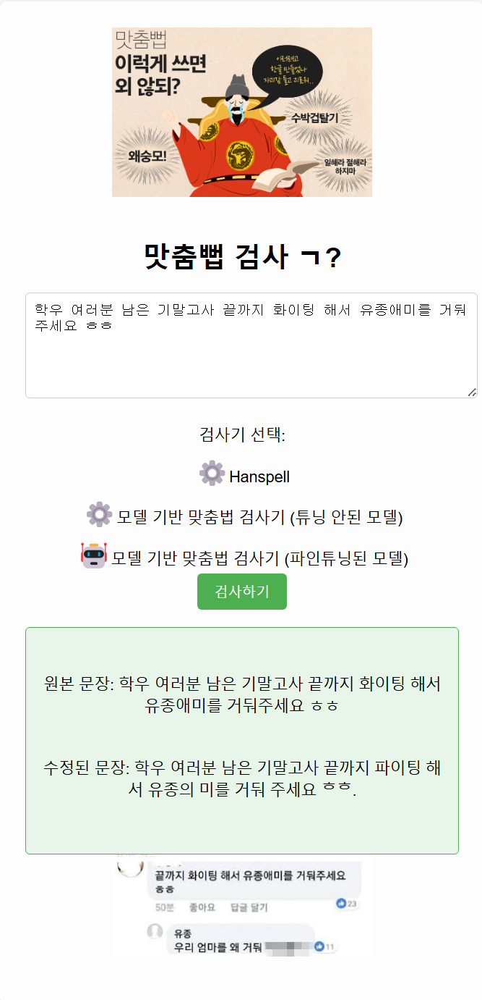

# 맛춤뻡 검사 ㄱ? (Ver. KR)

* * *
# 목차
	[0. 사용 모습](#0-사용-모습)
	[1. 프로젝트 개요](#1-프로젝트-개요)
	[2. 프로젝트 배경 및 필요성](#2-프로젝트-배경-및-필요성)
	[3. 시스템 설계](#3-시스템-설계)
	[4. 사용된 주요 라이브러리 및 도구](#4-사용된-주요-라이브러리-및-도구)
	[5. 결과 및 개선 사항](#5-결과-및-개선-사항)
	[6. 요약 및 결론](#6-요약-및-결론)
	[7. Reference](#7-Reference)
	[8. License](#8-License)
	[9. 코드 설명](#9-코드-설명)

## 0. 사용 모습
#### 1. KoreanSpellCheck의 파일들을 모두 다운 받습니다.

* * *

#### 2.Anaconda Prompt를 실행 후 cd를 통해 app.py코드가 있는 폴더(아마도 HanGeul_Bot)로 이동합니다.

* * *

#### 3. 오류를 방지하기 위해 가상환경을 설정하고 실행합니다. (이미 생성을 해서 gpt사진으로 대체)

* * *

#### 4. pip install -r requirements.txt을 Anaconda Prompt에 입력합니다. (많아서 시간 좀 걸립니다.)

* * *

#### 5. python app.py을 Anaconda Prompt에 입력하면 (http://127.0.0.1:5000/) 을 통해 검사기를 사용할 수 있습니다.

* * *

#### 6. 사용 모습 (hanspell 검사기, 튜닝 전 검사기)

##### hanspell 검사기에 "학우 여러분 남은 기말고사 끝까지 화이팅 해서 유종애미를 거둬주세요 ㅎㅎ"를 입력합니다.

##### 수정된 문장: 학우 여러분 남은 기말고사 끝까지 파이팅 해서 유종 어미를 거둬주세요 ㅎㅎ

##### 튜닝이 되지 않은 ET5모델에 "학우 여러분 남은 기말고사 끝까지 파이팅 해서 유종 어미를 거둬주세요 ㅎㅎ"를 입력합니다.

##### 수정된 문장: 학우 여러분 남은 기말고사 끝까지 파이팅 해서 유종애미를 거둬주세요 ᄒᄒ.

### 이처럼 나름 공식력 있는 네이버 검사기를 기반한 hanspell과 튜닝이 되지않은 ET5모델은 제대로 문장을 수정하지 못합니다.

##### 그래서 아래의 과정을 통해 데이터셋을 학습시켜 성능의 개선이 필요합니다. (파인튜닝 과정!)

* * *

#### 7. 어색한 문장을 사용자가 직접 데이터 셋에 추가 하는 모습

* * *

#### 8. random_sample.py실행 시 random_sample.json에 생성되는 모습 (경고문이 많이 뜨긴하는데, 작동에는 영향이 없습니다.)

	The attention mask and the pad token id were not set.
	AS a consequence, you may observe unexpected behavior.
	please pass your input's 'attention_mask' to obtain reliable results.

##### Attention mask와 Pad Token ID를 명시적으로 설정하지 않아 발생하는 오류입니다.
##### 하지만, Hugging Face의 transformers 라이브러리에서는 입력에 패딩이 포함되어 있으면 자동으로 이 값을 처리할 수 있습니다.
##### 즉, 경고문이 뜨지만 정상적인 작동을 하고 있습니다.

* * *

#### 9. 모델을 학습 시키는 모습

* * *

#### 10. 파인튜닝된 모델의 성능 개선을 확인 합니다.

##### 파인튜닝된 맞춤법 검사기 모델에 "학우 여러분 남은 기말고사 끝까지 화이팅 해서 유종애미를 거둬주세요 ㅎㅎ"를 입력합니다.

##### 수정된 문장: 학우 여러분 남은 기말고사 끝까지 파이팅 해서 유종의 미를 거둬 주세요 ᄒᄒ.

##### 서버를 개설하여 참여형 맞춤법 검사기를 만들면 더 좋은 검사 정확도를 가질 것으로 예상이됩니다.

##### 아직은 미흡하지만,,,
### 맞춤법 검사기의 위키피디아(혹은 나무위키...)가 되기 위한 시작으로도 볼 수 있을 것 같습니다. ㅎㅎ

* * *

## 1. 프로젝트 개요
본 프로젝트는 한국어 맞춤법 교정 모델을 학습시키고, 이를 활용한 웹 애플리케이션을 개발하여 사용자가 실시간으로 맞춤법을 교정할 수 있도록 하는 시스템입니다. 사용자가 입력한 텍스트에서 맞춤법 오류를 자동으로 찾아 교정하고, 이를 웹 인터페이스를 통해 즉시 확인할 수 있는 서비스를 제공합니다. 이 시스템은 Flask를 사용한 웹 서버와 PyTorch를 이용한 맞춤법 교정 모델을 결합하여 성능을 향상시켰습니다.
이 프로젝트는 한국어 맞춤법 교정의 정확도를 높이고, 사용자가 쉽게 접근할 수 있는 실용적인 도구를 제공하는 것을 목표로 하고 있습니다. 이를 통해, 텍스트 작성에서의 오류를 최소화하고, 더 신뢰할 수 있는 문서 작성이 가능해지도록 돕습니다. 최종적으로는 유저 참여형의 맞춤법 검사기를 만드는 것입니다. (미리 말하지만 서버 개설을 하지 못해 이건 실패하였습니다만, 서버만 개설하면 충분히 가능하다고 봅니다.)

* * *

## 2. 프로젝트 배경 및 필요성
한국어는 다양한 맞춤법 규정과 예외적인 규칙들로 인해 많은 사람들이 맞춤법 실수를 자주 범하는 언어입니다. 이를 해결하기 위한 자동화된 맞춤법 교정 시스템은 교육, 비즈니스, 연구 등 여러 분야에서 유용하게 활용될 수 있습니다. 하지만 기존의 맞춤법 검사기는 대부분 문어체에 집중되어 있으며, 구어체에 대한 교정은 부족한 실정입니다. 본 프로젝트는 이러한 한계를 극복하고, 구어체 교정까지 가능하도록 시스템을 확장하는 것을 목표로 합니다.

#### 1. 기존 맞춤법 교정기의 한계
   
	• 기존 맞춤법 검사기들은 문어체 위주로 개발되었고, 구어체나 고유명사, 특수한 문법에 대해서는 정확한 교정이 이루어지지 않습니다.

	• 머신러닝 기반의 검사기들은 여전히 정확도나 완전성에서 부족하며, 비즈니스, 교육, 연구 등의 중요한 분야에서 신뢰도가 떨어질 수 있습니다.

##### 2. 사용자 참여형 데이터셋 개선
   
	• 본 프로젝트는 집단지성의 접근 방식을 활용하여 교정기가 제대로 교정하지 못하는 오류를 데이터셋에 추가하거나 랜덤 샘플을 생성하여 모델 성능을 강화하는 방법을 도입합니다.

	• 교정기 성능 향상을 위해 사용자 피드백을 반영하고, 다양한 문법적 오류를 교정할 수 있도록 데이터셋을 확장합니다.
 
	• 사용자가 직접 만든 데이터셋을 ET5모델에 적용하여 맞춤법 검사기의 성능을 강화 시킵니다.

#### 3. 구어체 교정의 중요성
   
	• 기존 맞춤법 검사기는 대부분 문어체에 집중되어 있어 구어체 교정에 한계가 있습니다.

	• 구어체의 교정 또한 중요한 요소로, 사용자들이 실생활에서 쓰는 문장에 대한 교정을 제공함으로써, 더 실용적인 맞춤법 검사기를 목표로 합니다.

* * *

## 3. 시스템 설계
본 시스템은 데이터셋 생성, 모델 훈련과 웹 애플리케이션 세 가지 주요 구성 요소로 나뉩니다. 각 구성 요소는 맞춤법 교정 기능을 제공하기 위해 긴밀하게 연결되어 있습니다.
#### 1. 데이터셋 생성
#### 2. 모델 훈련(및파인튜닝)
#### 3. 웹 애플리케이션

파일구조는 [Github](https://github.com/DKim02/DKim02/tree/main/KoreanSpellCheck)를 참고해주시길 바랍니다.

각각의 코드에 대한 자세한 해설은 아래를 참고 해주시길 바랍니다.

[random_sample.py 파일 보기](#random_samplepy-파일-보기)

[train_model.py 파일 보기](#train_modelpy-파일-보기)

[app.py 파일 보기](#apppy-파일-보기)

[index.html 파일 보기](#indexhtml-파일-보기)

#### 복사과정에서 실수가 있을 수 있으니 이상한 경우 첨부된 코드를 참고해주세요.

* * *

## 3.1 데이터셋 생성
본 시스템에서 사용되는 데이터셋은 세 가지 방법으로 생성됩니다.

* * *

### 1. 랜덤 데이터셋 생성(1) ("random_sample.py" 코드 실행)

코드 실행 후 1번을 선택하면, KoGPT2 모델을 사용하여 무작위 문장을 생성하고, 이를 hanspell을 통해 교정한 후, 추가적인 전처리 과정을 거쳐 random_sample.json 파일로 저장됩니다. 

#### 1.1 KoGPT2로 무작위 문장 생성 
#### 1.2 생성된 문장을 Hanspell로 문장 교정
#### 1.3 전처리 및 random_sample.json 파일로 저장

이 데이터셋은 모델 훈련에 사용되며, 주로 문어체에서의 다양한 맞춤법 오류와 교정된 문장을 포함하고 있습니다.

* * *

### 2. 랜덤 데이터셋 생성(2) ("random_sample.py" 코드 실행)

코드 실행 후 2번을 선택하면, 국립 국어원의 "맞춤법 교정 말뭉치 2022" 데이터셋을 사용하여 주로 구어체 문장을 중심으로 데이터셋을 생성합니다. 

#### 2.1 국립 국어원에서 제공하는 말뭉치 사용 (MXEC2202210100.json)
#### 2.2 형식에 맞게 해당 json파일을 불러와 전처리 한 후 random_sample.json 파일로 저장

이 데이터셋은 모델 훈련에 사용되며, 주로 구어체에서의 다양한 맞춤법 오류와 교정된 문장을 포함하고 있습니다.

* * *

### 3. 직접 형식에 맞춰서 입력

사용자가 맞춤법 검사기를 사용하면서, 개선이 되었으면 하는 부분을 직접 데이터셋에 입력하고, 파인튜닝시킬 수 있습니다.

#### 3.1 "random_sample.json"파일을 실행
#### 3.2 "input_texts"와 "output_texts"에 형식에 맞게 직접 기입 후 저장

	// <random_sample.json의 형식>
	{
   		"input_texts": [
   		"맞춤법을 고쳐주세요: 학우 여러분 남은 기말고사 끝까지 화이팅 해서 유종애미를 거둬주세요 ㅎㅎ"
 
 		],
  		"output_texts": [
 		"학우 여러분 남은 기말고사 끝까지 파이팅 해서 유종의 미를 거둬주세요 ㅎㅎ"
 		]
	}

추가로 공개된 데이터셋을 사용하고 싶다면 random_sample.py에서 파일을 입력 부분을 고치면 된다.

만약 "수정 전", "수정 후"의 쌍을 이루고 있지 않는 데이터 셋이라면 "수정 전"을 hanspell을 이용해 "수정 후"의 데이터 셋으로 만들 수 있다.

* * *

## 3.2 모델 훈련(및 파인튜닝)
본 프로젝트에서는 ET5 모델을 사용하여 맞춤법 교정 모델을 훈련시킵니다. 하지만 시간과 컴퓨터 성능의 한계로 인해, ET5 모델을 처음부터 훈련시키기보다는 et5-typos-corrector 모델을 사용하여 훈련을 진행했습니다. 이 모델은 이미 맞춤법 교정에 특화된 데이터셋으로 파인튜닝된 상태로 제공되며, 모델을 불러와 random_sample.json 데이터셋을 사용하여 추가적인 파인튜닝을 수행했습니다.(et5-typos-corrector은 결국 국립국어원의 데이터셋을 학습 시킨 것으로 시간을 단축시키기 위해 사용하였습니다.)

[et5-typos-corrector](https://huggingface.co/j5ng/et5-typos-corrector)
해당 링크를 통해 자세한 설명을 보실 수 있습니다. (PLM모델인 ET5를 사용하여 국립국어원이 제공하는 데이터셋을 학습하였습니다.)

파인튜닝 과정은 다음과 같이 진행되었습니다:

#### 1. 기존 모델 로드: HuggingFace에서 제공하는 et5-typos-corrector 모델을 불러와 사용.
#### 2. 데이터셋 로딩: 앞서 생성한 random_sample.json 파일을 로드하여 훈련 데이터로 활용.
#### 3. 파인튜닝: 기존 모델에 새로운 데이터셋을 train_model.py를 통해 추가 학습하여 성능을 개선.
#### 4. 모델 저장: 파인튜닝이 완료된 모델은 fine_tuned_model 폴더에 저장되어, 후속 작업에 사용됩니다.

** train_model.py를 통한 학습은 cpu와 gpu의 사용 여부 선능에 따라 소요시간은 천차만별입니다. **

이 과정에 대한 자세한 내용은 train_model.py 코드에서 확인할 수 있습니다.

* * *

## 3.3 웹 애플리케이션
웹 애플리케이션은 Flask 프레임워크를 사용하여 구현되었습니다. 사용자는 웹 페이지에서 텍스트를 입력하고, 제출 버튼을 클릭하면 실시간으로 맞춤법 교정을 받을 수 있습니다. 이 웹 애플리케이션은 사용자 친화적인 UI를 제공하며, 맞춤법 교정 기능을 빠르고 효율적으로 수행할 수 있도록 설계되었습니다.

#### 웹 애플리케이션의 주요 구성 요소:

#### Flask 웹 서버:
app.py 파일에서 Flask 웹 서버를 실행합니다. ("requirement.txt"를 다운 받고 실행하셔야합니다.)
서버가 실행이 된 후 [링크](http://127.0.0.1:5000/)를 통해서 확인하실 수 있습니다.
웹 서버는 사용자가 입력한 텍스트를 받아, 해당 텍스트에 대한 맞춤법 교정을 수행한 후 교정된 텍스트를 반환합니다.
서버는 클라이언트와의 통신을 관리하며, 맞춤법 교정 모델을 통해 결과를 전달합니다.

**재정 이슈가 발생하여 서버를 개설하지 못하고, 로컬로 만든 점 양해 부탁드립니다.**

#### UI 설계:
index.html: 사용자에게 텍스트 입력란과 교정 결과를 출력하는 HTML 페이지를 제공합니다. 텍스트 입력란에 문장을 입력하고 "맞춤법 검사하기" 버튼을 클릭하면 서버로 요청을 보냅니다.

위에 사진에서는 안보이겠지만 다크모드도 존재합니다.

#### 동작 흐름:
사용자가 웹 페이지에서 텍스트를 입력한 후, "맞춤법 검사하기" 버튼을 클릭하면 입력된 텍스트가 Flask 서버로 전송됩니다.
서버는 전송된 텍스트를 모델에 전달하여 맞춤법 교정을 수행합니다.
교정된 결과를 다시 웹 페이지로 반환하여 사용자가 교정된 텍스트를 확인할 수 있습니다.

웹 애플리케이션은 빠르고 직관적인 교정 결과를 제공하며, 다양한 입력 문장을 처리할 수 있습니다. 이를 통해 사용자는 실시간으로 맞춤법을 교정받을 수 있습니다.

* * *

## 4. 사용된 주요 라이브러리 및 도구
- Python: 프로젝트의 주 프로그래밍 언어
- Hugging Face: 사전 학습된 모델과 훈련 지원
- KoGPT2: 한국어 GPT-2 모델을 기반으로 한 문장 생성
- Flask: 웹 서버 구축을 위한 Python 프레임워크
- PyTorch: 머신러닝 모델 훈련과 추론을 위한 라이브러리
- ET5: 텍스트 수정 및 맞춤법 교정 모델 (Seq2seq방식의 모델)
- hanspell: 외부 맞춤법 검사기 모듈
- JSON: 데이터셋 저장 및 불러오기

* * *

## 5. 결과 및 개선 사항
##### 모델 교정 정확도
모델은 대부분의 문어체 문장에서 정확한 맞춤법 교정을 수행했습니다. 일반적인 맞춤법 오류 (띄어쓰기, 철자 오류 등)에서 높은 성능을 보였습니다.
또한, 네이버 맞춤법 검사기 기반인 hanspell을 통한 검사 결과도 제공하므로 사용자는 상호보완적으로 맞춤법을 검사할 수 있을 입니다.

##### 성능 개선 여부:
파인튜닝을 통해 기존 모델에 비해 맞춤법 교정 성능이 향상되었으며, 특히 표준어 교정에서 좋은 성능을 보였습니다.
그러나 문장의 길이가 너무 길어지면 비교적 정확도가 떨어집니다. 이는 데이터셋들이 모두 한문장 위주로 구성되었기 때문에 긴 문장에는 취약함을 보입니다. 
이는 다양한 구조의 데이터셋을 추가로 파인튜닝을 시키면 충분히 해결될 것으로 보입니다.

#### 앞으로의 방향
##### 1. 다양한 언어를 학습시키는 방향 (다양한 언어 지원 검사기)
##### 2. 많은 데이터셋을 학습시켜서 보다 나은 정확도를 가지게 하기
##### 3. 좀 더 실험을 하는 것처럼 수치로 결과를 환산시켜보기.
##### 4. 서버를 개설하고 유저들이 로컬이 아닌 서버로 사용하며, 최종적으로는 참여형 맞춤법 검사기 만들
##### etc...

#### 짧은 소감:
다소 아쉬운 점이 있다면, 머신러닝을 사용하는 프로젝트이지만, 시간과 기기성능의 한계로 많은 데이터셋을 학습 시키지 못했다는 것이다.
이를 통해 결과의 정확도도 수치로 검수할 수 있었으면 좋았겠지만, 데이터셋에 직접 수정을 하면 대부분 맞게 나와서 큰 의미가 있을까 싶긴하다.

최종적인 목표는 유저 참여형의 맞춤법 검사기를 만드는 것인데, 서버를 개설하기 못한 점 또한 아쉬웠다.

한 영역을 제대로 파고 들어가고도 싶었으나 (백엔드든, 프론트엔드든, 웹이든, 머신러닝이든...), 아직 진로의 방향을 제대로 잡지못해, 조금 부족해도 전부를 조금씩 경험하고 싶었다.

전혀 모르는 분야도 있어서 따로 공부하고, GPT를 열심히 돌리느라 시간이 꽤나 오래 걸렸던 것 같다. 

덕분에 이게 왜 되나 싶은 것도 있다...

아직은 미흡하지만, 시간이 날 때마다 조금씩 개선을해서 보다 나은 결과물을 만들어보고 싶다.

컴퓨터 공학과에서 처음으로 프로젝트같은 프로젝트를 했는데, 지금은 충분히 만족스럽다. (나중에 보면 다소 부끄러울 지 모르겠지만...)

또한, 가능한 시간이 되는대로 개선을 하여 직접 서버에 배포하여 돌려보고싶다. (언젠가는 앱으로도...)

* * *

## 6. 요약 및 결론

앞서 살펴 보았던 것과 같이 프로젝트의 큰 틀은 아래와 같습니다.
#### 1. KoGPT2모델을 이용해 문장을 생성하고, 전처리 과정을 거쳐 데이터셋으로 사용합니다.
#### 2. 1의 방법으로는 한계(대부분 문어체 위주라 구어체의 수정에 문제가 있을 수 있음)가 있으므로 국립 국어원에서 제공하는 데이터셋을 추가로 학습시킵니다.
#### 3. 이렇게 학습이 된 파인튜닝 모델을 이용하여 맞춤법을 검사를 시행합니다. 
#### 4. 3가지 방식으로 맞춤법 검사를 제공하는데, 1번은 hanspell을 이용한 것이고, 2번은 튜닝 전 모델을 이용, 3번은 튜닝 후 모델을 사용합니다.
#### 5. 비용 문제로 서버를 구현하지 못해 로컬에서만 적용이되나, 서버를 구현하면, 사용자가 직접 데이터셋을 튜닝시켜, 더 좋은 맞춤법 검사기 모델이 될 것으로 예상이됩니다.

본 프로젝트는 한국어 맞춤법 교정 모델을 훈련시키고, 이를 웹 애플리케이션으로 구현하는 데 성공했습니다. 이 시스템은 사용자가 텍스트를 입력하고 즉시 교정된 결과를 확인할 수 있도록 해주며, 향후 개선 작업을 통해 더욱 정확한 맞춤법 교정 모델을 제공할 수 있습니다.

* * *

## 7. Reference
- [Hugging Face KoGPT2](https://huggingface.co/skt/kogpt2-base-v2)
- [ET5 모델](https://aiopen.etri.re.kr/et5Model)
- [파인튜닝된 ET5 모델](https://huggingface.co/j5ng/et5-typos-corrector)
- [국립 국어원 맞춤법 교정 말뭉치](https://kli.korean.go.kr/corpus/main/requestMain.do?lang=ko#none)

* * *

## 8. License

1. **KoGPT2**:
   - **라이선스**: [CC-BY-NC-SA 4.0](https://creativecommons.org/licenses/by-nc-sa/4.0/)
   - **내용**: KoGPT2 모델은 CC-BY-NC-SA 4.0 라이선스 하에 공개되어 있습니다. 이 라이선스는 비상업적 사용만을 허용하며, 수정 및 재배포가 가능합니다. 상업적 용도로 사용 시 별도의 동의가 필요합니다.

2. **ET5 모델**:
   - **라이선스**: [Apache 2.0 License](https://www.apache.org/licenses/LICENSE-2.0)
   - **내용**: ET5 모델의 연구용 활용은 Apache 2.0 라이선스를 따릅니다. 이 라이선스는 상업적 사용, 수정 및 재배포를 허용합니다. 다만, 소스 코드 변경 사항을 명시하고 원 저작권 고지를 해야 하며, 특허권도 보호받습니다.

3. **py-hanspell**:
   - **라이선스**: [MIT License](https://opensource.org/licenses/MIT)
   - **내용**: py-hanspell은 MIT 라이선스 하에 제공됩니다. 이 라이선스는 상업적 사용, 수정 및 재배포를 자유롭게 허용하며, 소스 코드 변경 사항을 명시할 필요는 없지만, 원 저작자와 라이선스를 반드시 명시해야 합니다.

4. **Flask**:
   - **라이선스**: [BSD-3-Clause License](https://opensource.org/licenses/BSD-3-Clause)
   - **내용**: Flask는 BSD 3-Clause License 하에 제공됩니다. 이 라이선스는 상업적 사용 및 수정 후 재배포가 가능하지만, 소스 코드 수정 시 라이선스와 저작권 고지를 명시해야 합니다.

5. **PyTorch**:
   - **라이선스**: [BSD-3-Clause License](https://opensource.org/licenses/BSD-3-Clause)
   - **내용**: PyTorch는 BSD 3-Clause License 하에 제공됩니다. 상업적 사용과 수정 후 재배포가 가능하지만, 소스 코드 수정 시 라이선스와 저작권 고지를 명시해야 합니다.

6. **transformers (HuggingFace)**:
   - **라이선스**: [Apache 2.0 License](https://www.apache.org/licenses/LICENSE-2.0)
   - **내용**: HuggingFace Transformers 라이브러리는 Apache 2.0 라이선스 하에 제공됩니다. 소스 코드 수정 및 재배포가 자유로우며, 변경 사항을 명시하고 원 저작권 고지를 포함해야 합니다.

7. **sentencepiece**:
   - **라이선스**: [Apache 2.0 License](https://www.apache.org/licenses/LICENSE-2.0)
   - **내용**: SentencePiece는 Apache 2.0 라이선스 하에 제공됩니다. 사용 및 배포가 자유로우며, 라이선스를 명시해야 합니다.

8. **scikit-learn**:
   - **라이선스**: [BSD-3-Clause License](https://opensource.org/licenses/BSD-3-Clause)
   - **내용**: scikit-learn은 BSD 3-Clause License 하에 제공됩니다. 상업적 사용 및 수정 후 재배포가 가능합니다. 다만, 소스 코드 수정 시 라이선스와 저작권 고지를 명시해야 합니다.

9. **datasets (Hugging Face Datasets 라이브러리)**:
   - **라이선스**: [Apache 2.0 License](https://www.apache.org/licenses/LICENSE-2.0)
   - **내용**: Datasets 라이브러리는 Apache 2.0 라이선스 하에 제공되며, 상업적 사용과 수정 후 재배포가 가능합니다.
	

* * *

## 9. 코드 설명

## random_sample.py 파일 보기
#### random_sample.py
	import json
	import random
	from hanspell import spell_checker
	import torch
	from transformers import GPT2LMHeadModel, PreTrainedTokenizerFast
	import re
	
	# ------------------------------------------------------------
	# 이 스크립트는 두 가지 방법으로 "입력 텍스트 -> 맞춤법 교정된 출력 텍스트" 쌍을 생성하여
	# 별도의 JSON 파일로 저장하는 역할을 합니다.
	#
	# 1. 국립국어원 제공 JSON 데이터셋 기반:
	#    - 주어진 JSON 파일(MXEC2202210100.json)에서 원문과 교정문 쌍을 가져와 그 중 일부를 랜덤 샘플링합니다.
	#    - 샘플링한 문장을 "맞춤법을 고쳐주세요:"라는 프롬프트 형태의 입력과, 정제된 교정문을 출력으로 지정합니다.
	#
	# 2. 랜덤 생성 문장 기반:
	#    - GPT-2 기반 한국어 언어모델을 로드하여, 사전에 정의된 단어 리스트 중 랜덤한 단어를 골라 해당 단어를 기반으로 문장을 생성합니다.
	#    - 생성된 문장에 hanspell 패키지를 사용하여 맞춤법 교정을 한 후,
	#      "맞춤법을 고쳐주세요:"라는 프롬프트가 포함된 입력과 교정된 문장을 페어로 만듭니다.
	#
	# 두 경우 모두 결과를 JSON 파일(random_sample.json)에 덧붙이는 형태로 저장합니다.
	# ------------------------------------------------------------
	
	# 모델 및 토크나이저 경로
	model_path = "./d0c0df48bf2b2c9350dd855021a5b216f560c0c7"
	tokenizer_path = "./d0c0df48bf2b2c9350dd855021a5b216f560c0c7"
	
	# 데이터셋 관련 파일 경로
	output_file = "./dataset/random_sample.json"  # 생성한 데이터셋을 저장할 파일
	input_file = "./dataset/MXEC2202210100.json" # 국립국어원 JSON 파일 경로
	
	def load_model():
	    """
	    사전 학습된 GPT-2 언어 모델과 토크나이저를 로드하고 GPU 사용 가능 시 GPU로 이동합니다.
	    """
	    device = torch.device('cuda' if torch.cuda.is_available() else 'cpu')
	    tokenizer = PreTrainedTokenizerFast.from_pretrained(tokenizer_path)
	    model = GPT2LMHeadModel.from_pretrained(model_path)
	    model.to(device)
	    return model, tokenizer, device

	def generate_random_sentence(model, tokenizer, device, input_text):
	    """
	    입력 텍스트(input_text)를 기반으로 모델을 사용하여 문장을 생성합니다.
	    생성 과정:
	    - 최대 길이 50 토큰까지 문장 생성
	    - 반복되는 n-gram 방지
	    - 마침표('.')가 등장하면 그 지점에서 문장을 마칩니다.
	    """
	    input_ids = tokenizer.encode(input_text, return_tensors='pt').to(device)
	    output = model.generate(
	        input_ids,
	        max_length=50,
	        num_return_sequences=1,
	        no_repeat_ngram_size=2,
	        pad_token_id=tokenizer.eos_token_id,
	        eos_token_id=tokenizer.encode('.')[0]
	    )
	    generated_text = tokenizer.decode(output[0], skip_special_tokens=True)
	
	    # 마침표가 등장하면 해당 마침표까지만 문장을 자릅니다.
	    if '.' in generated_text:
	        generated_text = generated_text.split('.')[0] + '.'
	
	    return generated_text
	
	def correct_spelling(input_text):
	    """
	    hanspell을 사용하여 입력 문장에 대한 맞춤법 교정을 수행하고, 교정된 문장을 반환합니다.
	    """
	    corrected = spell_checker.check(input_text)
	    return corrected.checked
	
	def clean_text(text):
	    """
	    텍스트 전처리 함수:
	    - 특정 특수문자 제거 (.,)
	    - &name\d+& 형태로 들어간 이름 태그 제거
	    - 너무 짧은 문장은 빈 문자열로 처리
	    """
	    # 특수문자 제거
	    text = re.sub(r"[.,]", "", text)
	    # &name\d+& 형태 제거
	    text = re.sub(r"\S*&name\d+&\S*", "", text)
	    # 길이가 2 미만이면 빈 문자열 반환
	    if len(text) < 2:
	        return ""
	    return text
	
	def load_existing_data():
	    """
	    기존에 주어진 국립국어원 JSON 파일에서 원본 문장(original_form)과 교정된 문장(corrected_form)을 읽어옵니다.
	    전처리를 통해 불필요한 부분을 제거하고, (원문, 교정문) 쌍을 리스트로 반환합니다.
	    """
	    try:
	        with open(input_file, "r", encoding="utf-8") as f:
	            dataset = json.load(f)
	    except FileNotFoundError:
	        print("파일을 찾을 수 없습니다.")
	        return []
	
	    utterances = []
	    for document in dataset.get('document', []):
	        for utterance in document.get('utterance', []):
	            original_form = utterance.get('original_form', '')
	            corrected_form = utterance.get('corrected_form', '')
	
	            # 전처리 적용
	            original_form = clean_text(original_form)
	            corrected_form = clean_text(corrected_form)
	
	            # 전처리 후 유효한 문장만 리스트에 추가
	            if original_form and corrected_form:
	                utterances.append((original_form, corrected_form))
	
	    return utterances
	
	def get_random_samples(utterances, num_samples=3):
	    """
	    주어진 (원문, 교정문) 쌍 리스트 중에서 num_samples 개수를 랜덤 샘플링합니다.
	    샘플링된 결과를 '맞춤법을 고쳐주세요: 원문' 형태의 input_texts와 교정문 output_texts로 분리하여 반환합니다.
	    """
	    random.seed()  # 랜덤 시드를 고정하지 않아 매 실행마다 결과가 달라집니다.
	    sampled_utterances = random.sample(utterances, num_samples)
	    input_texts = [f"맞춤법을 고쳐주세요: {item[0]}" for item in sampled_utterances]
	    output_texts = [item[1] for item in sampled_utterances]
	    return input_texts, output_texts
	
	def prepare_data_for_training(is_random):
	    """
	    랜덤 단어 기반으로 GPT-2를 통해 문장을 생성하고, hanspell로 맞춤법 교정을 수행합니다.
	    - 사전에 정의된 random_words 리스트에서 단어를 하나 고른 뒤, 이를 기반으로 문장을 생성.
	    - 생성된 문장을 맞춤법 교정 후, '맞춤법을 고쳐주세요: 생성문장' 형태의 입력과 교정문을 페어로 반환.
	    """
	    model, tokenizer, device = load_model()
	
	    input_texts = []
	    output_texts = []
	
	    # 랜덤 문장 생성을 위한 단어 리스트 (사전 정의)
	    random_words = [
	        "사랑", "기후", "운동", "기술", "사회", "음악", "여행", "책", "날씨", "경제",
	        "게임", "교육", "정치", "문화", "영화", "음식", "취미", "직업", "사회적", "기업",
	        "철학", "사회적", "미래", "과학", "예술", "디지털", "로봇", "우주", "행복", "건강",
	        "사회적", "보안", "패션", "자율성", "언어", "소셜", "개발", "탐험", "환경", "가치",
	        "혁신", "인공지능", "정보", "리더십", "책임", "평등", "연대", "공정", "진보", "자유",
	        "도전", "상상", "창의성", "협력", "연구", "테크", "디자인", "커리어", "창업", "복지",
	        "디지털화", "로봇공학", "인터넷", "스마트폰", "기술적", "전략", "친환경", "소셜미디어",
	        "브랜딩", "인테리어", "자율주행", "블록체인", "클라우드", "빅데이터", "AI", "교육과정",
	        "프로그래밍", "데이터", "네트워크", "연구개발", "스타트업", "경제학", "금융", "자산관리",
	        "비즈니스", "트렌드", "스마트시티", "디지털트윈", "모바일", "웨어러블", "카메라", "5G",
	        "IoT", "스마트홈", "헬스케어", "글로벌", "사회적책임", "전자상거래", "디지털화", "e커머스"
	    ]
	
	    # 여기서는 5개의 문장을 생성해봄
	    for i in range(5):
	        # 랜덤 단어 선택
	        random_word = random.choice(random_words)
	
	        # 해당 단어를 시작점으로 문장 생성
	        sentence = generate_random_sentence(model, tokenizer, device, random_word)
	        # 맞춤법 교정
	        corrected_sentence = correct_spelling(sentence)
	
	        # "맞춤법을 고쳐주세요:" 라는 프롬프트 형태의 입력-출력 쌍 저장
	        input_texts.append(f"맞춤법을 고쳐주세요: {sentence}")
	        output_texts.append(corrected_sentence)
	
	    return input_texts, output_texts
	
	def append_to_json(input_texts, output_texts):
	    """
	    생성된 input_texts, output_texts 데이터를 기존 JSON 파일에 덧붙여 저장합니다.
	    - 기존 random_sample.json 파일을 읽어 input_texts, output_texts를 확장한 뒤 다시 저장합니다.
	    - 파일이 없을 경우 새로운 구조의 JSON을 생성합니다.
	    """
	    try:
	        with open(output_file, "r", encoding="utf-8") as f:
	            existing_data = json.load(f)
	    except FileNotFoundError:
	        # 파일이 없으면 새로운 구조로 초기화
	        existing_data = {"input_texts": [], "output_texts": []}
	
	    # 새로운 데이터를 기존 데이터에 추가
	    existing_data["input_texts"].extend(input_texts)
	    existing_data["output_texts"].extend(output_texts)
	
	    # 덧붙인 데이터를 다시 JSON 파일로 저장
	    with open(output_file, "w", encoding="utf-8") as f:
	        json.dump(existing_data, f, ensure_ascii=False, indent=4)
	
	    print(f"랜덤 샘플링된 데이터가 {output_file}에 덧붙여졌습니다.")
	
	def choose_learning_method():
	    """
	    사용자에게 데이터셋 생성 방식을 선택하게 한 뒤,
	    선택된 방식에 따라 데이터 생성 로직을 실행합니다.
	    1. 국립국어원 JSON 데이터 기반
	    2. 랜덤 문장 생성 기반
	    """
	    print("데이터셋 생성 방법을 선택하세요:")
	    print("1. 국립국어원 JSON 파일 기반으로 생성")
	    print("2. 랜덤으로 문장 생성")
	
	    choice = input("번호를 선택하세요: ")
	
	    if choice == "1":
	        # 기존 국립국어원 JSON 파일에서 (원문, 교정문) 쌍을 랜덤 추출
	        print("기존 JSON 파일을 학습합니다.")
	        utterances = load_existing_data()
	        input_texts, output_texts = get_random_samples(utterances, num_samples=10)
	        append_to_json(input_texts, output_texts)
	    elif choice == "2":
	        # GPT-2를 사용해 랜덤한 문장을 만들고, 맞춤법 교정한 뒤 JSON 파일에 저장
	        print("랜덤 문장을 학습합니다.")
	        input_texts, output_texts = prepare_data_for_training(is_random=True)
	        append_to_json(input_texts, output_texts)
	
	# 메인 실행부
	if __name__ == "__main__":
	    choose_learning_method()
	

## train_model.py 파일 보기
#### train_model.py
	import torch
	from transformers import T5ForConditionalGeneration, T5Tokenizer
	from transformers import Trainer, TrainingArguments
	import json
	from sklearn.model_selection import train_test_split
	
	# ------------------------------------------------------------
	# 이 스크립트는 T5 모델을 활용하여 맞춤법 교정 모델을 파인튜닝하는 과정의 예시를 보여줍니다.
	#
	# 주요 흐름:
	# 1. 사전 학습된 T5 맞춤법 교정 모델과 토크나이저 로드
	# 2. 미리 준비된 JSON 데이터에서 "input_texts"와 "output_texts"를 불러옴
	# 3. 데이터 전처리 후 훈련/검증 데이터로 분할
	# 4. 토크나이저를 사용하여 텍스트를 인덱싱
	# 5. PyTorch Dataset 형태로 변환
	# 6. Trainer를 활용하여 파인튜닝 수행
	# 7. 파인튜닝 완료 후 모델과 토크나이저 저장
	#
	# 주석을 통해 각 단계별로 역할을 명확히 설명하였습니다.
	# ------------------------------------------------------------
	
	# T5 모델 및 토크나이저 로드
	# "j5ng/et5-typos-corrector" 모델은 미리 한글 맞춤법 교정에 최적화된 T5 계열 모델
	model = T5ForConditionalGeneration.from_pretrained("j5ng/et5-typos-corrector")
	tokenizer = T5Tokenizer.from_pretrained("j5ng/et5-typos-corrector")
	
	# JSON 데이터 파일 로드
	# 이 파일에는 {"input_texts": [...], "output_texts": [...]} 구조로 데이터가 저장되어 있음
	input_file = "./dataset/random_sample.json"
	with open(input_file, "r", encoding="utf-8") as f:
	    data = json.load(f)
	
	# "input_texts"와 "output_texts" 분리
	input_texts = data["input_texts"]
	output_texts = data["output_texts"]
	
	# 훈련 세트와 검증 세트로 분할
	# test_size=0.2는 20% 데이터를 검증용으로 사용
	train_df, val_df = train_test_split(list(zip(input_texts, output_texts)), test_size=0.2, random_state=42)
	
	# T5 모델 훈련에 맞추어 입력 문장 전처리
	# "맞춤법을 고쳐주세요: " 문구를 앞에 붙여, 모델이 교정 작업을 해야 함을 명시
	# 출력 문장 끝에 "."를 붙여 마침표로 문장 종결 형식 유지 (선택 사항)
	train_input = ["맞춤법을 고쳐주세요: " + item[0] for item in train_df]
	train_output = [item[1] + "." for item in train_df]
	
	val_input = ["맞춤법을 고쳐주세요: " + item[0] for item in val_df]
	val_output = [item[1] + "." for item in val_df]
	
	# 토크나이징:
	# max_length=128: 문장 최대 길이를 128 토큰으로 제한
	# padding=True, truncation=True: 필요한 경우 패딩 및 잘라내기
	train_encodings = tokenizer(train_input, max_length=128, padding=True, truncation=True)
	train_labels_encodings = tokenizer(train_output, max_length=128, padding=True, truncation=True)
	
	val_encodings = tokenizer(val_input, max_length=128, padding=True, truncation=True)
	val_labels_encodings = tokenizer(val_output, max_length=128, padding=True, truncation=True)
	
	# PyTorch Dataset 클래스 정의
	# 모델 학습에 필요한 형태로 데이터를 만들어줌
	class SpellCorrectionDataset(torch.utils.data.Dataset):
	    def __init__(self, encodings, labels_encodings):
	        self.encodings = encodings
	        self.labels_encodings = labels_encodings
	
	    def __getitem__(self, idx):
	        # encodings에서 인덱스 idx의 토큰 텐서들을 가져옴
	        item = {key: torch.tensor(val[idx]) for key, val in self.encodings.items()}
	        # labels는 labels_encodings의 input_ids를 사용
	        item["labels"] = torch.tensor(self.labels_encodings["input_ids"][idx])
	        return item
	
	    def __len__(self):
	        return len(self.encodings["input_ids"])
	
	# 훈련/검증용 Dataset 생성
	train_dataset = SpellCorrectionDataset(train_encodings, train_labels_encodings)
	val_dataset = SpellCorrectionDataset(val_encodings, val_labels_encodings)
	
	# TrainingArguments 설정
	# 모델 출력 경로, 학습률, 배치 사이즈, 에폭 수, weight decay 등 설정
	training_args = TrainingArguments(
	    output_dir="./outputs",
	    evaluation_strategy="epoch",   # 매 epoch마다 검증
	    learning_rate=1e-4,
	    per_device_train_batch_size=32,
	    num_train_epochs=8,
	    weight_decay=0.01,
	    save_strategy="epoch",         # 매 epoch마다 체크포인트 저장
	    metric_for_best_model="eval_loss", 
	    greater_is_better=False        # eval_loss는 작을수록 좋음
	)
	
	# Trainer 초기화
	trainer = Trainer(
	    model=model,
	    args=training_args,
	    train_dataset=train_dataset,
	    eval_dataset=val_dataset,
	)
	
	# 모델 파인튜닝 시작
	trainer.train()
	
	# 파인튜닝 완료 후 모델과 토크나이저 저장
	model.save_pretrained("./fine_tuned_model", safe_serialization=False)
	tokenizer.save_pretrained("./fine_tuned_model")
	
	# PyTorch 형식으로 모델 가중치 저장
	torch.save(model.state_dict(), './fine_tuned_model/pytorch_model.bin')
	
	print("훈련 완료 및 모델 저장 완료")
	
	
## app.py 파일 보기
#### app.py
	from flask import Flask, render_template, request, jsonify
	import torch
	from transformers import T5ForConditionalGeneration, T5Tokenizer
	from hanspell import spell_checker  # Hanspell 사용
	
	# ------------------------------------------------------------
	# 이 Flask 애플리케이션은 다음 세 가지 맞춤법 검사 방식을 제공합니다:
	# 1. 파인튜닝되지 않은 기본 모델(untuned_model)을 사용한 맞춤법 교정
	# 2. 파인튜닝된 모델(fine_tuned_model)을 사용한 맞춤법 교정
	# 3. Hanspell 패키지를 이용한 맞춤법 교정
	#
	# 사용자는 웹 인터페이스(index.html)에서 텍스트를 입력하고, 
	# 원하는 검사기(untuned, tuned, hanspell)를 선택하여 맞춤법 교정을 요청할 수 있습니다.
	#
	# 주요 로직:
	# - '/' 라우트: index.html 렌더링(메인 페이지)
	# - '/check' 라우트: POST 방식으로 텍스트 및 검사기 타입을 받아 맞춤법 검사 결과 반환
	#
	# 이 코드는 Flask 앱을 실행시킨 뒤, localhost:5000 (또는 지정한 포트)에서 
	# 웹페이지에 접속해 텍스트를 입력하고 검사 결과를 확인할 수 있습니다.
	# ------------------------------------------------------------
	
	app = Flask(__name__)
	
	# 파인튜닝된 모델 및 토크나이저 로드 경로
	model_path = './fine_tuned_model'
	tokenizer_path = './fine_tuned_model'
	
	# 파인튜닝되지 않은 모델 로드
	# "j5ng/et5-typos-corrector"는 기본 한글 맞춤법 교정 T5 모델
	untuned_model = T5ForConditionalGeneration.from_pretrained("j5ng/et5-typos-corrector")
	untuned_tokenizer = T5Tokenizer.from_pretrained("j5ng/et5-typos-corrector")
	
	# 파인튜닝된 모델 로드
	fine_tuned_model = T5ForConditionalGeneration.from_pretrained(model_path)
	fine_tuned_tokenizer = T5Tokenizer.from_pretrained(tokenizer_path)
	
	# GPU 사용 가능 여부 확인하여 모델 디바이스 설정
	device = torch.device("cuda" if torch.cuda.is_available() else "cpu")
	untuned_model.to(device)
	fine_tuned_model.to(device)
	
	@app.route('/')
	def index():
	    """
	    메인 페이지 렌더링: index.html 반환
	    사용자가 웹 UI를 통해 텍스트를 입력하고, 검사 방식을 선택할 수 있는 인터페이스 제공
	    """
	    return render_template('index.html')
	
	@app.route('/check', methods=['POST'])
	def check_spelling():
	    """
	    맞춤법 검사 요청을 처리하는 엔드포인트.
	    사용자가 입력한 텍스트와 선택한 검사기 타입을 받아, 해당 방식으로 맞춤법 교정 후 결과를 JSON 형태로 반환.
	    """
	    text = request.form.get('text')  # 사용자가 입력한 텍스트
	    checker_type = request.form.get('checker')  # 선택된 검사기 유형 (untuned, tuned, hanspell)
	
	    if not text:
	        return jsonify({'error': '텍스트를 입력해주세요.'})
	
	    # 선택된 검사 방식에 따라 처리
	    if checker_type == 'model_untuned':
	        # 파인튜닝되지 않은 모델로 맞춤법 교정
	        input_encoding = untuned_tokenizer("맞춤법을 고쳐주세요: " + text, return_tensors="pt").to(device)
	        input_ids = input_encoding.input_ids
	        attention_mask = input_encoding.attention_mask
	
	        # T5 모델을 사용해 결과 생성
	        output_encoding = untuned_model.generate(
	            input_ids=input_ids,
	            attention_mask=attention_mask,
	            max_length=128,
	            num_beams=5,
	            early_stopping=True,
	        )
	        output_text = untuned_tokenizer.decode(output_encoding[0], skip_special_tokens=True)
	
	        return jsonify({
	            'original_text': text,
	            'checked_text': output_text
	        })
	
	    elif checker_type == 'model_tuned':
	        # 파인튜닝된 모델로 맞춤법 교정
	        input_encoding = fine_tuned_tokenizer("맞춤법을 고쳐주세요: " + text, return_tensors="pt").to(device)
	        input_ids = input_encoding.input_ids
	        attention_mask = input_encoding.attention_mask
	
	        # 파인튜닝된 모델을 사용한 결과 생성
	        output_encoding = fine_tuned_model.generate(
	            input_ids=input_ids,
	            attention_mask=attention_mask,
	            max_length=128,
	            num_beams=5,
	            early_stopping=True,
	        )
	        output_text = fine_tuned_tokenizer.decode(output_encoding[0], skip_special_tokens=True)
	
	        return jsonify({
	            'original_text': text,
	            'checked_text': output_text
	        })
	
	    elif checker_type == 'hanspell':
	        # Hanspell 라이브러리를 사용한 맞춤법 교정
	        try:
	            corrected_text = spell_checker.check(text).checked
	            return jsonify({
	                'original_text': text,
	                'checked_text': corrected_text
	            })
	        except Exception as e:
	            return jsonify({
	                'error': f'Hanspell 처리 중 오류 발생: {str(e)}'
	            })
	
	    else:
	        # 지원하지 않는 검사기 타입일 경우 에러 반환
	        return jsonify({'error': '잘못된 검사기 선택입니다.'})
	
	if __name__ == '__main__':
	    # 개발용 서버 실행 (디버그 모드)
	    # 실제 배포 시에는 WSGI 서버를 사용하여 실행 권장 (아쉽게도 이부분은 비용문제로 진행하지 못함)
	    app.run(debug=True)
	
	
## index.html 파일 보기	
#### index.html

이 섹션에서는 `index.html` 파일의 주요 구조와 기능에 대해 설명합니다. 코드에는 사용자 인터페이스를 구성하는 HTML, 스타일을 정의하는 CSS, 그리고 사용자 인터랙션을 처리하는 JavaScript가 포함되어 있습니다. 코드를 자세히 보려면 메모장 같은 텍스트 편집기나 VSCode, Atom과 같은 코드 에디터로 열어보실 수 있습니다.

#### 주요 구성 요소

1. **헤더 (Header)**
   
   **메타 태그**: 문자 인코딩과 뷰포트 설정을 정의하여 다양한 디바이스에서 올바르게 표시되도록 합니다.
   
   **제목**: 브라우저 탭에 표시될 페이지 제목을 설정합니다.
   
   **스타일**: 내부 CSS를 사용하여 페이지의 레이아웃과 디자인을 정의합니다.

2. **본문 (Body)**
   
   **로고 이미지**: 페이지 상단과 하단에 위치한 로고 이미지를 표시합니다.
   
   **페이지 제목**: "맞춤법 검사기"라는 제목을 중앙에 배치합니다.
   
   **맞춤법 검사 폼**:
   
   **텍스트 입력 영역**: 사용자가 맞춤법을 검사할 텍스트를 입력하는 공간입니다.
   
   **검사기 선택 라디오 버튼**: 다양한 맞춤법 검사기 중에서 선택할 수 있도록 합니다.
   
   **검사하기 버튼**: 입력된 텍스트를 선택한 검사기를 통해 검토합니다.
   
   **결과 표시 영역**: 맞춤법 검사 결과를 사용자에게 보여줍니다.
   
   **다크모드 전환 버튼**: 페이지의 테마를 밝은 모드와 어두운 모드로 전환합니다.
   

3. **JavaScript**
    
   **다크모드 전환 기능**: 사용자가 버튼을 클릭할 때마다 페이지의 테마를 변경합니다.
   
   **맞춤법 검사 폼 제출 이벤트 핸들러**: 폼이 제출되면 페이지를 새로고침하지 않고 AJAX 요청을 통해 서버에 데이터를 전송하고, 응답 결과를 동적으로 표시합니다.
  

 <!DOCTYPE html>
	<html lang="ko">
	<head>
	    <meta charset="UTF-8">
	    <meta name="viewport" content="width=device-width, initial-scale=1.0">
	    <title>맞춤법 검사기</title>
	    
	</head>
	<body>
	    

	        <!-- 상단 로고 이미지 -->
	         
	        
	        <!-- 페이지 제목 -->
	        <h1>맞춤법 검사기</h1>
	        
	        <!-- 맞춤법 검사 폼 -->
	        <form id="spellcheck-form" action="/check" method="post">
	            <!-- 텍스트 입력 영역 -->
	            <textarea id="text-input" name="text" placeholder="텍스트를 입력하세요"></textarea> 
	            
	            <!-- 검사기 선택 라디오 버튼 -->
	            <label>검사기 선택:</label> 
	            <!-- Hanspell 검사기 선택 라디오 버튼 -->
	            <input type="radio" id="hanspell" name="checker" value="hanspell" checked>
	            <label for="hanspell">Hanspell</label> 
	            <!-- 파인튜닝되지 않은 모델 기반 검사기 선택 라디오 버튼 -->
	            <input type="radio" id="model_untuned" name="checker" value="model_untuned">
	            <label for="model_untuned">모델 기반 맞춤법 검사기 (튜닝 안된 모델)</label> 
	            <!-- 파인튜닝된 모델 기반 검사기 선택 라디오 버튼 -->
	            <input type="radio" id="model_tuned" name="checker" value="model_tuned">
	            <label for="model_tuned">모델 기반 맞춤법 검사기 (파인튜닝된 모델)</label> 
	            
	            <!-- 검사 시작 버튼 -->
	            <button type="submit">검사하기</button>
	        </form>
	        
	        <!-- 맞춤법 검사 결과 표시 영역 -->
	        

	            

 <!-- 원본 텍스트 표시 -->
	            

 <!-- 수정된 텍스트 표시 -->
	        
 <!-- 결과 영역 종료 -->
	        
	        <!-- 하단 로고 이미지 -->
	         
	    

	    
	    <!-- 다크모드 전환 버튼 -->
	    <button id="toggle-theme">다크모드 전환</button>
	    
	    
	</body>
	</html>

