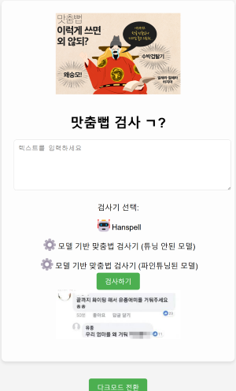
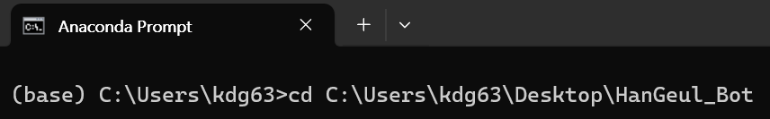
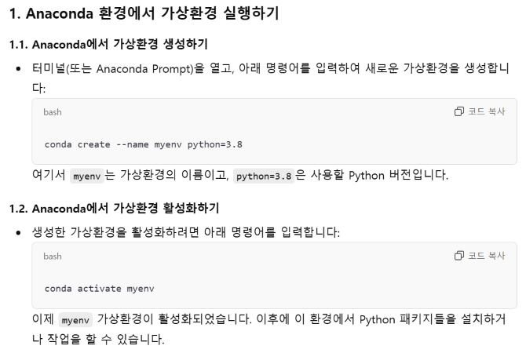
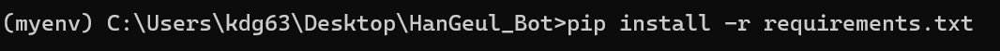
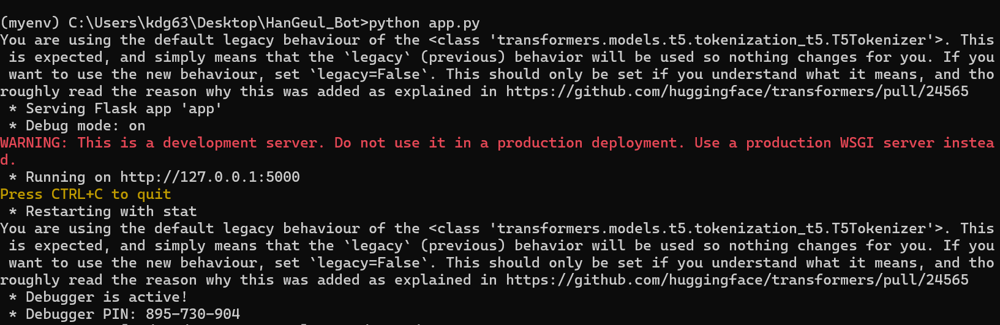
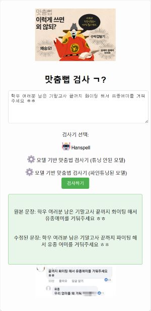
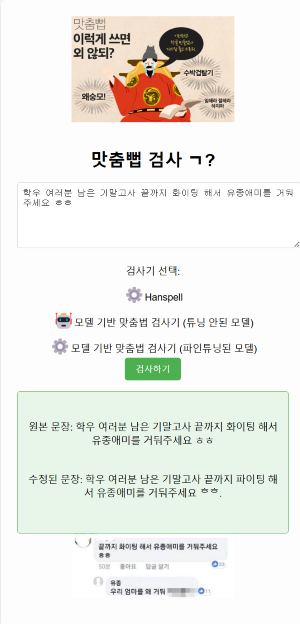

# Spelling Checker? (Ver. KR)



* * *

# Table of Contents
- [0. Usage](#0-usage)
- [1. Project Overview](#1-project-overview)
- [2. Project Background and Necessity](#2-project-background-and-necessity)
- [3. System Design](#3-system-design)
- [4. Key Libraries and Tools Used](#4-key-libraries-and-tools-used)
- [5. Results and Improvements](#5-results-and-improvements)
- [6. Summary and Conclusion](#6-summary-and-conclusion)
- [7. Reference](#7-reference)
- [8. License](#8-license)
- [9. Code Explanation](#9-code-explanation)

## 0. Usage
#### 1. Download all files of KoreanSpellCheck.

* * *

#### 2. Run Anaconda Prompt and navigate to the folder containing `app.py` (probably `HanGeul_Bot`) using `cd`.


* * *

#### 3. To prevent errors, set up and activate the virtual environment. (Already created, replaced with GPT image)


* * *

#### 4. Enter `pip install -r requirements.txt` in Anaconda Prompt. (It takes some time due to the number of packages.)


* * *

#### 5. Enter `python app.py` in Anaconda Prompt, and you can use the checker via [http://127.0.0.1:5000/](http://127.0.0.1:5000/).


* * *

#### 6. Usage Example (Hanspell Checker, Untuned Model Checker)



##### In the Hanspell checker, enter "학우 여러분 남은 기말고사 끝까지 화이팅 해서 유종애미를 거둬주세요 ㅎㅎ".
##### Corrected Sentence: "학우 여러분 남은 기말고사 끝까지 파이팅 해서 유종 어미를 거둬주세요 ㅎㅎ".

##### In the untuned ET5 model, enter "학우 여러분 남은 기말고사 끝까지 파이팅 해서 유종애미를 거둬주세요 ㅎㅎ".
##### Corrected Sentence: "학우 여러분 남은 기말고사 끝까지 파이팅 해서 유종애미를 거둬주세요 ㅎㅎ."

### As shown, the official Naver-based hanspell and the untuned ET5 model do not correct sentences properly.
##### Therefore, the following process is needed to train the dataset for performance improvement. (Fine-tuning process!)

* * *


## 1. Project Overview
This project aims to train a Korean spelling correction model and develop a web application that allows users to perform real-time spelling corrections. The system automatically detects and corrects spelling errors in user-inputted text and provides immediate confirmation through a web interface. This system combines a Flask-based web server with a PyTorch-based spelling correction model to enhance performance.
The project aims to improve the accuracy of Korean spelling correction and provide a practical tool that users can easily access. This helps minimize errors in text creation and enables more reliable document writing. Ultimately, the goal is to create a user-participatory spelling checker. (As mentioned earlier, I couldn't set up the server due to cost issues, but I believe it is fully achievable once the server is established.)

* * *

## 2. Project Background and Necessity
Korean is a language with various spelling rules and exceptional regulations, causing many people to frequently make spelling mistakes. An automated spelling correction system to address this can be useful in education, business, research, and other fields. However, existing spelling checkers mostly focus on written language, and corrections for colloquial language are lacking. This project aims to overcome these limitations and expand the system to enable corrections for colloquial language as well.

#### 1. Limitations of Existing Spelling Correction Tools
- Existing spelling checkers are primarily developed for written language and do not accurately correct colloquial expressions, proper nouns, or special grammar.
- Machine learning-based checkers still lack accuracy and completeness, which can reduce reliability in important areas such as business, education, and research.

##### 2. Improvement of Dataset through User Participation
- This project adopts a collective intelligence approach by adding errors that the checker fails to correct to the dataset or generating random samples to strengthen the model's performance.
- To enhance the checker’s performance, user feedback is incorporated, and the dataset is expanded to correct various grammatical errors.
- Users directly modify the dataset and apply it to the ET5 model to strengthen the spelling checker’s performance.

#### 3. Importance of Colloquial Language Correction
- Most existing spelling checkers focus on written language, limiting their ability to correct colloquial expressions.
- Correcting colloquial language is also crucial, as it provides practical spelling corrections for sentences used in everyday life, aiming to develop a more practical spelling checker.

* * *

## 3. System Design
The system is divided into three main components: dataset generation, model training and fine-tuning, and web application. Each component is closely connected to provide spelling correction functionality.

Refer to the [GitHub](https://github.com/DKim02/DKim02/tree/main/KoreanSpellCheck) for the file structure.

For detailed explanations of each code, please refer below.

[random_sample.py File View](#random_samplepy-file-view)

[train_model.py File View](#train_modelpy-file-view)

[app.py File View](#apppy-file-view)

[index.html File View](#indexhtml-file-view)

#### There may be mistakes during the copying process, so please refer to the attached code if something seems odd.

* * *

## 3.1 Dataset Generation
The datasets used in this system are generated through three methods.

* * *

### 1. Random Dataset Generation (1) (Running "random_sample.py" Code)

After running the code and selecting option 1, it uses the KoGPT2 model to generate random sentences, corrects them using hanspell, and then processes them further to save as `random_sample.json`.

#### 1.1 Generating Random Sentences with KoGPT2
#### 1.2 Correcting Generated Sentences with Hanspell
#### 1.3 Preprocessing and Saving to `random_sample.json`

This dataset is used for model training and primarily includes various spelling errors and corrected sentences in written language.

* * *

### 2. Random Dataset Generation (2) (Running "random_sample.py" Code)

After running the code and selecting option 2, it uses the National Institute of Korean Language's "Spelling Correction Corpus 2022" dataset to generate a dataset focused mainly on colloquial sentences.

#### 2.1 Using the Corpus Provided by the National Institute of Korean Language (MXEC2202210100.json)
#### 2.2 Loading and Preprocessing the JSON File to Save as `random_sample.json`

This dataset is used for model training and primarily includes various spelling errors and corrected sentences in colloquial language.

* * *

### 3. Manually Inputting in the Correct Format

Users can directly add parts they wish to improve into the dataset and fine-tune the model.

#### 3.1 Running the "random_sample.json" File
#### 3.2 Manually Filling in "input_texts" and "output_texts" According to the Format and Saving

    ```json
    // <Format of random_sample.json>
    {
        "input_texts": [
            "Please correct the spelling: 학우 여러분 남은 기말고사 끝까지 화이팅 해서 유종애미를 거둬주세요 ㅎㅎ"
        ],
        "output_texts": [
            "학우 여러분 남은 기말고사 끝까지 파이팅 해서 유종의 미를 거둬주세요 ㅎㅎ"
        ]
    }


## 3.2 Model Training (and Fine-Tuning)
In this project, the ET5 model is used to train the spelling correction model. However, due to time and computer performance limitations, instead of training the ET5 model from scratch, the `et5-typos-corrector` model was used for training. This model is already fine-tuned on a spelling correction-specialized dataset and was used to save time by loading it directly. (Ultimately, the `et5-typos-corrector` was trained on the National Institute of Korean Language's dataset to shorten training time.)

[et5-typos-corrector](https://huggingface.co/j5ng/et5-typos-corrector)  
You can refer to this link for a detailed explanation. (The ET5 PLM model was trained on the dataset provided by the National Institute of Korean Language.)

The fine-tuning process was carried out as follows:

#### 1. Loading the Existing Model
Load and use the HuggingFace-provided `et5-typos-corrector` model.

#### 2. Loading the Dataset
Load the `random_sample.json` file prepared earlier as the training data.

#### 3. Fine-Tuning
Perform additional training using `train_model.py` with the new dataset to improve performance.

#### 4. Saving the Model
After fine-tuning, save the fine-tuned model in the `fine_tuned_model` folder for subsequent tasks.

**Training via `train_model.py` can take varying amounts of time depending on CPU and GPU usage.**

Detailed information about this process can be found in the `train_model.py` code.

* * *

## 3.3 Web Application
The web application is implemented using the Flask framework. Users can input text on the web page and click the submit button to receive real-time spelling corrections. This web application provides a user-friendly UI and is designed to perform spelling correction functions quickly and efficiently.

#### Key Components of the Web Application:

#### Flask Web Server
Runs the Flask web server in the `app.py` file. (You need to download and run "requirements.txt.")
After the server is running, you can check it via the [link](http://127.0.0.1:5000/).
The server receives the text input from the user, performs spelling correction on the text using the model, and returns the corrected text.
The server manages communication between the client and the model to deliver results.

**Due to financial issues, I couldn't set up the server, but if it were, it would have been feasible.**

#### UI Design
`index.html`: Provides an HTML page with a text input field and a section to display corrected results. Users input sentences in the text input field and click the "Check Spelling" button to send requests to the server.

Although not visible in the photos above, dark mode also exists.

#### Workflow
After the user inputs text on the web page and clicks the "Check Spelling" button, the entered text is sent to the Flask server.
The server passes the transmitted text to the model to perform spelling correction.
The corrected result is returned to the web page for the user to view.
The web application provides quick and intuitive correction results and can handle various input sentences. This allows users to receive real-time spelling corrections.

* * *

## 4. Key Libraries and Tools Used
- **Python**: The main programming language of the project.
- **Hugging Face**: Pre-trained models and training support.
- **KoGPT2**: A Korean GPT-2-based language model for sentence generation.
- **Flask**: Python framework for building the web server.
- **PyTorch**: Library for training and inference of machine learning models.
- **ET5**: Text correction and spelling correction model (Seq2seq-based model).
- **hanspell**: External spelling checker module.
- **JSON**: For saving and loading datasets.

* * *


## 5. Results and Improvements
##### Model Correction Accuracy
The model performed accurate spelling corrections in most written language sentences. It showed high performance in correcting common spelling errors (spacing, spelling mistakes, etc.).
Additionally, results provided by the Naver-based hanspell checker are available, allowing users to perform complementary spelling checks.

##### Performance Improvement:
Through fine-tuning, the spelling correction performance improved compared to the existing model, especially showing good performance in standard language corrections.
However, when sentences become too long, the accuracy decreases relatively. This is because the datasets are mostly composed of single sentences, making the model vulnerable to long sentences.
This can be sufficiently resolved by adding and fine-tuning with datasets of various structures.

#### Future Directions
##### 1. Training with Various Languages (Spelling Checkers Supporting Multiple Languages)
##### 2. Training with More Datasets to Achieve Better Accuracy
##### 3. Conducting Experiments to Quantify Results Numerically
##### 4. Setting Up a Server and Creating a Participatory Spelling Checker for Users to Use on the Server Instead of Locally
##### etc...

#### Short Reflection:
One somewhat disappointing aspect is that although it's a machine learning project, I couldn't train with a large dataset due to time and hardware limitations.
It would have been better to quantify the results numerically, but since most direct modifications to the dataset result in accurate corrections, I wondered if it was significantly meaningful.
The ultimate goal is to create a user-participatory spelling checker, but I was also disappointed that I couldn't set up the server.

While wanting to delve deeply into one area (backend, frontend, web, machine learning, etc.), I couldn't decide my career path properly and wanted to experience all areas a bit, even though there are areas I know nothing about. I had to study separately, and running GPT diligently took a considerable amount of time.

Thanks to this, things sometimes work in unexpected ways...

Although it is still insufficient, I want to improve it little by little when I have time and create better results.
This is the first project-like project I did in computer science, and I am quite satisfied now. (It might be somewhat embarrassing when I look back later...)

Also, I hope to improve it as much as possible and deploy it on a server to run it directly by users. (Someday as an app too...)

* * *

## 6. Summary and Conclusion

As discussed earlier, the project's main framework is as follows:
#### 1. Use the KoGPT2 model to generate sentences, preprocess them, and use them as a dataset.
#### 2. Since method 1 has limitations (mainly focused on written language, may have issues with colloquial language corrections), additionally train using the dataset provided by the National Institute of Korean Language.
#### 3. Use the fine-tuned model from step 2 to perform spelling checks.
#### 4. Provide three methods of spelling checks: 1) using hanspell, 2) using the untuned model, and 3) using the fine-tuned model.
#### 5. Due to cost issues, couldn't implement the server and apply it locally, but if the server is implemented, users can directly fine-tune the dataset to create a better spelling correction model.

This project successfully trained a Korean spelling correction model and implemented it into a web application. This system allows users to input text and immediately see the corrected results. With future improvements, it can provide more accurate spelling correction models.

* * *

## 7. Reference
- [Hugging Face KoGPT2](https://huggingface.co/skt/kogpt2-base-v2)
- [ET5 Model](https://aiopen.etri.re.kr/et5Model)
- [Fine-Tuned ET5 Model](https://huggingface.co/j5ng/et5-typos-corrector)
- [National Institute of Korean Language Spelling Correction Corpus](https://kli.korean.go.kr/corpus/main/requestMain.do?lang=ko#none)

* * *

## 8. License

1. **KoGPT2**:
   - **License**: [CC-BY-NC-SA 4.0](https://creativecommons.org/licenses/by-nc-sa/4.0/)
   - **Details**: The KoGPT2 model is released under the CC-BY-NC-SA 4.0 license. This license allows non-commercial use and permits modifications and redistribution. Commercial use requires separate consent.

2. **ET5 Model**:
   - **License**: [Apache 2.0 License](https://www.apache.org/licenses/LICENSE-2.0)
   - **Details**: The ET5 model is provided under the Apache 2.0 License for research use. This license allows commercial use, modifications, and redistribution, but requires specifying changes and including the original copyright.

3. **py-hanspell**:
   - **License**: [MIT License](https://opensource.org/licenses/MIT)
   - **Details**: py-hanspell is provided under the MIT License. This license allows commercial use, modifications, and redistribution freely, but requires crediting the original authors and including the license.

4. **Flask**:
   - **License**: [BSD-3-Clause License](https://opensource.org/licenses/BSD-3-Clause)
   - **Details**: Flask is provided under the BSD 3-Clause License. This license allows commercial use and modifications with redistribution, but requires specifying the license and copyright.

5. **PyTorch**:
   - **License**: [BSD-3-Clause License](https://opensource.org/licenses/BSD-3-Clause)
   - **Details**: PyTorch is provided under the BSD 3-Clause License. It allows commercial use and modifications with redistribution, but requires specifying the license and copyright.

6. **transformers (HuggingFace)**:
   - **License**: [Apache 2.0 License](https://www.apache.org/licenses/LICENSE-2.0)
   - **Details**: The HuggingFace Transformers library is provided under the Apache 2.0 License. It allows modifications and redistribution freely, but requires specifying changes and including the original copyright.

7. **sentencepiece**:
   - **License**: [Apache 2.0 License](https://www.apache.org/licenses/LICENSE-2.0)
   - **Details**: SentencePiece is provided under the Apache 2.0 License. It allows use and distribution freely, but requires specifying the license.

8. **scikit-learn**:
   - **License**: [BSD-3-Clause License](https://opensource.org/licenses/BSD-3-Clause)
   - **Details**: scikit-learn is provided under the BSD 3-Clause License. It allows commercial use and modifications with redistribution, but requires specifying the license and copyright.

9. **datasets (Hugging Face Datasets Library)**:
   - **License**: [Apache 2.0 License](https://www.apache.org/licenses/LICENSE-2.0)
   - **Details**: The Datasets library is provided under the Apache 2.0 License, allowing commercial use, modifications, and redistribution.


## 9. Code Explanation
## random_sample.py File View
#### random_sample.py

import json
import random
from hanspell import spell_checker
import torch
from transformers import GPT2LMHeadModel, PreTrainedTokenizerFast
import re

# ------------------------------------------------------------
# This script generates "input text -> corrected output text" pairs
# through two methods and saves them as a separate JSON file.
#
# 1. Based on the JSON dataset provided by the National Institute of Korean Language:
#    - Extracts pairs of original and corrected sentences from the given JSON file (MXEC2202210100.json) and randomly samples some of them.
#    - Formats the sampled sentences as inputs with the prompt "Please correct the spelling:" and sets the corrected sentences as outputs.
#
# 2. Based on randomly generated sentences:
#    - Loads a pre-trained Korean GPT-2 language model to generate sentences by selecting random words from a predefined word list.
#    - Corrects the generated sentences using the hanspell package and pairs them with inputs in the form of "Please correct the spelling:".
#
# In both cases, the results are appended to the JSON file (`random_sample.json`).
# ------------------------------------------------------------

# Model and tokenizer paths
model_path = "./d0c0df48bf2b2c9350dd855021a5b216f560c0c7"
tokenizer_path = "./d0c0df48bf2b2c9350dd855021a5b216f560c0c7"

# Dataset-related file paths
output_file = "./dataset/random_sample.json"  # File to save the generated dataset
input_file = "./dataset/MXEC2202210100.json" # Path to the National Institute of Korean Language JSON file

def load_model():
    """
    Loads the pre-trained GPT-2 language model and tokenizer, and moves them to GPU if available.
    """
    device = torch.device('cuda' if torch.cuda.is_available() else 'cpu')
    tokenizer = PreTrainedTokenizerFast.from_pretrained(tokenizer_path)
    model = GPT2LMHeadModel.from_pretrained(model_path)
    model.to(device)
    return model, tokenizer, device

def generate_random_sentence(model, tokenizer, device, input_text):
    """
    Generates a sentence based on the input_text using the model.
    Generation process:
    - Generates up to 50 tokens.
    - Prevents repeating n-grams.
    - Stops the sentence generation upon encountering a period '.'.
    """
    input_ids = tokenizer.encode(input_text, return_tensors='pt').to(device)
    output = model.generate(
        input_ids,
        max_length=50,
        num_return_sequences=1,
        no_repeat_ngram_size=2,
        pad_token_id=tokenizer.eos_token_id,
        eos_token_id=tokenizer.encode('.')[0]
    )
    generated_text = tokenizer.decode(output[0], skip_special_tokens=True)

    # Truncate the sentence at the first period.
    if '.' in generated_text:
        generated_text = generated_text.split('.')[0] + '.'

    return generated_text

def correct_spelling(input_text):
    """
    Performs spelling correction on the input_text using hanspell and returns the corrected sentence.
    """
    corrected = spell_checker.check(input_text)
    return corrected.checked

def clean_text(text):
    """
    Text preprocessing function:
    - Removes specific special characters (.,)
    - Removes name tags in the form &name\d+&
    - Treats sentences shorter than 2 characters as empty strings
    """
    # Remove special characters
    text = re.sub(r"[.,]", "", text)
    # Remove &name\d+& patterns
    text = re.sub(r"\S*&name\d+&\S*", "", text)
    # Return empty string if length is less than 2
    if len(text) < 2:
        return ""
    return text

def load_existing_data():
    """
    Loads original and corrected sentences from the given JSON file provided by the National Institute of Korean Language.
    Applies preprocessing to remove unnecessary parts and returns a list of (original, corrected) pairs.
    """
    try:
        with open(input_file, "r", encoding="utf-8") as f:
            dataset = json.load(f)
    except FileNotFoundError:
        print("File not found.")
        return []

    utterances = []
    for document in dataset.get('document', []):
        for utterance in document.get('utterance', []):
            original_form = utterance.get('original_form', '')
            corrected_form = utterance.get('corrected_form', '')

            # Apply preprocessing
            original_form = clean_text(original_form)
            corrected_form = clean_text(corrected_form)

            # Add to list only if both sentences are valid after preprocessing
            if original_form and corrected_form:
                utterances.append((original_form, corrected_form))

    return utterances

def get_random_samples(utterances, num_samples=3):
    """
    Randomly samples num_samples pairs from the list of (original, corrected) utterances.
    Separates them into input_texts with the prompt and output_texts as corrected sentences.
    """
    random.seed()  # Do not fix the random seed to get different results each run
    sampled_utterances = random.sample(utterances, num_samples)
    input_texts = [f"Please correct the spelling: {item[0]}" for item in sampled_utterances]
    output_texts = [item[1] for item in sampled_utterances]
    return input_texts, output_texts

def prepare_data_for_training(is_random):
    """
    Generates sentences using GPT-2 based on random words and corrects them using hanspell.
    - Selects a random word from a predefined list.
    - Generates a sentence based on the selected word.
    - Corrects the generated sentence using hanspell.
    - Saves the input-output pairs with the prompt and corrected sentence.
    """
    model, tokenizer, device = load_model()

    input_texts = []
    output_texts = []

    # Predefined list of random words for sentence generation
    random_words = [
        "love", "climate", "exercise", "technology", "society", "music", "travel", "book", "weather", "economy",
        "game", "education", "politics", "culture", "movie", "food", "hobby", "profession", "social", "company",
        "philosophy", "social", "future", "science", "art", "digital", "robot", "space", "happiness", "health",
        "social", "security", "fashion", "autonomy", "language", "social media", "development", "exploration", "environment", "value",
        "innovation", "artificial intelligence", "information", "leadership", "responsibility", "equality", "solidarity", "fairness", "progress", "freedom",
        "challenge", "imagination", "creativity", "collaboration", "research", "tech", "design", "career", "startup", "welfare",
        "digitalization", "robotics", "internet", "smartphone", "technical", "strategy", "eco-friendly", "social media",
        "branding", "interior", "autonomous driving", "blockchain", "cloud", "big data", "AI", "curriculum",
        "programming", "data", "network", "research and development", "startup", "economics", "finance", "asset management",
        "business", "trend", "smart city", "digital twin", "mobile", "wearable", "camera", "5G",
        "IoT", "smart home", "healthcare", "global", "corporate social responsibility", "e-commerce", "digitalization", "e-commerce"
    ]

    # Generate 5 sentences
    for i in range(5):
        # Select a random word
        random_word = random.choice(random_words)

        # Generate a sentence starting with the selected word
        sentence = generate_random_sentence(model, tokenizer, device, random_word)
        # Correct the spelling
        corrected_sentence = correct_spelling(sentence)

        # Save the input-output pair with the prompt
        input_texts.append(f"Please correct the spelling: {sentence}")
        output_texts.append(corrected_sentence)

    return input_texts, output_texts

def append_to_json(input_texts, output_texts):
    """
    Appends the generated input_texts and output_texts to the existing JSON file.
    - Reads the existing random_sample.json file and extends the input_texts and output_texts.
    - Saves the updated data back to the JSON file.
    - If the file does not exist, initializes a new JSON structure.
    """
    try:
        with open(output_file, "r", encoding="utf-8") as f:
            existing_data = json.load(f)
    except FileNotFoundError:
        # Initialize a new structure if the file does not exist
        existing_data = {"input_texts": [], "output_texts": []}

    # Add new data to existing data
    existing_data["input_texts"].extend(input_texts)
    existing_data["output_texts"].extend(output_texts)

    # Save the appended data back to the JSON file
    with open(output_file, "w", encoding="utf-8") as f:
        json.dump(existing_data, f, ensure_ascii=False, indent=4)

    print(f"Randomly sampled data has been appended to {output_file}.")

def choose_learning_method():
    """
    Prompts the user to select a dataset generation method and executes the corresponding data generation logic.
    1. Generate based on the National Institute of Korean Language JSON file
    2. Generate based on random sentence generation
    """
    print("Select a dataset generation method:")
    print("1. Generate based on the National Institute of Korean Language JSON file")
    print("2. Generate random sentences")

    choice = input("Please select a number: ")

    if choice == "1":
        # Randomly extract (original, corrected) pairs from the existing National Institute of Korean Language JSON file
        print("Training with the existing JSON file.")
        utterances = load_existing_data()
        input_texts, output_texts = get_random_samples(utterances, num_samples=10)
        append_to_json(input_texts, output_texts)
    elif choice == "2":
        # Generate random sentences using GPT-2, correct them with hanspell, and save to JSON file
        print("Training with random sentences.")
        input_texts, output_texts = prepare_data_for_training(is_random=True)
        append_to_json(input_texts, output_texts)

# Main execution
if __name__ == "__main__":
    choose_learning_method()


## train_model.py File View
#### train_model.py

import torch
from transformers import T5ForConditionalGeneration, T5Tokenizer
from transformers import Trainer, TrainingArguments
import json
from sklearn.model_selection import train_test_split

# ------------------------------------------------------------
# This script demonstrates the process of fine-tuning a T5 model
# for spelling correction using a pre-trained T5 model.
#
# Main Flow:
# 1. Load the pre-trained T5 spelling correction model and tokenizer.
# 2. Load "input_texts" and "output_texts" from the prepared JSON data.
# 3. Preprocess the data and split it into training and validation sets.
# 4. Tokenize the text using the tokenizer.
# 5. Convert the data into PyTorch Dataset format.
# 6. Perform fine-tuning using Trainer.
# 7. Save the fine-tuned model and tokenizer after training.
#
# Each step is clearly explained with comments.
# ------------------------------------------------------------

# Load the T5 model and tokenizer
# "j5ng/et5-typos-corrector" is a pre-fine-tuned T5 model specialized for Korean spelling correction
model = T5ForConditionalGeneration.from_pretrained("j5ng/et5-typos-corrector")
tokenizer = T5Tokenizer.from_pretrained("j5ng/et5-typos-corrector")

# Load JSON data file
# This file contains data in the format {"input_texts": [...], "output_texts": [...]}
input_file = "./dataset/random_sample.json"
with open(input_file, "r", encoding="utf-8") as f:
    data = json.load(f)

# Separate "input_texts" and "output_texts"
input_texts = data["input_texts"]
output_texts = data["output_texts"]

# Split into training and validation sets
# test_size=0.2 means 20% of the data is used for validation
train_df, val_df = train_test_split(list(zip(input_texts, output_texts)), test_size=0.2, random_state=42)

# Preprocess input sentences for T5 training
# Prefix with "Please correct the spelling: " to indicate the task to the model
# Optionally, append a period '.' at the end of output sentences to maintain sentence termination
train_input = ["Please correct the spelling: " + item[0] for item in train_df]
train_output = [item[1] + "." for item in train_df]

val_input = ["Please correct the spelling: " + item[0] for item in val_df]
val_output = [item[1] + "." for item in val_df]

# Tokenize:
# max_length=128: limit sentence length to 128 tokens
# padding=True, truncation=True: apply padding and truncation as needed
train_encodings = tokenizer(train_input, max_length=128, padding=True, truncation=True)
train_labels_encodings = tokenizer(train_output, max_length=128, padding=True, truncation=True)

val_encodings = tokenizer(val_input, max_length=128, padding=True, truncation=True)
val_labels_encodings = tokenizer(val_output, max_length=128, padding=True, truncation=True)

# Define PyTorch Dataset class
# Converts data into the format required for model training
class SpellCorrectionDataset(torch.utils.data.Dataset):
    def __init__(self, encodings, labels_encodings):
        self.encodings = encodings
        self.labels_encodings = labels_encodings

    def __getitem__(self, idx):
        # Retrieve token tensors for the given index
        item = {key: torch.tensor(val[idx]) for key, val in self.encodings.items()}
        # Use input_ids from labels_encodings as labels
        item["labels"] = torch.tensor(self.labels_encodings["input_ids"][idx])
        return item

    def __len__(self):
        return len(self.encodings["input_ids"])

# Create training and validation datasets
train_dataset = SpellCorrectionDataset(train_encodings, train_labels_encodings)
val_dataset = SpellCorrectionDataset(val_encodings, val_labels_encodings)

# Set up TrainingArguments
# Defines output directory, learning rate, batch size, number of epochs, weight decay, etc.
training_args = TrainingArguments(
    output_dir="./outputs",
    evaluation_strategy="epoch",   # Evaluate at the end of each epoch
    learning_rate=1e-4,
    per_device_train_batch_size=32,
    num_train_epochs=8,
    weight_decay=0.01,
    save_strategy="epoch",         # Save checkpoints at the end of each epoch
    metric_for_best_model="eval_loss", 
    greater_is_better=False        # Lower eval_loss is better
)

# Initialize Trainer
trainer = Trainer(
    model=model,
    args=training_args,
    train_dataset=train_dataset,
    eval_dataset=val_dataset,
)

# Start model fine-tuning
trainer.train()

# Save the fine-tuned model and tokenizer
model.save_pretrained("./fine_tuned_model", safe_serialization=False)
tokenizer.save_pretrained("./fine_tuned_model")

# Save model weights in PyTorch format
torch.save(model.state_dict(), './fine_tuned_model/pytorch_model.bin')

print("Training complete and model saved.")


## app.py File View
#### app.py


from flask import Flask, render_template, request, jsonify
import torch
from transformers import T5ForConditionalGeneration, T5Tokenizer
from hanspell import spell_checker  # Using Hanspell

# ------------------------------------------------------------
# This Flask application provides three spelling correction methods:
# 1. Spelling correction using an untuned model (untuned_model)
# 2. Spelling correction using a fine-tuned model (fine_tuned_model)
# 3. Spelling correction using the Hanspell package
#
# Users can input text on the web interface (index.html),
# select the desired checker (untuned, tuned, hanspell),
# and receive spelling corrections.
#
# Main Logic:
# - '/' Route: Renders index.html (main page)
# - '/check' Route: Handles POST requests to receive text and checker type,
#                     performs spelling correction, and returns results in JSON format.
#
# After running the Flask app, users can access the web page at localhost:5000
# to input text and view corrected results.
# ------------------------------------------------------------

app = Flask(__name__)

# Paths to the fine-tuned model and tokenizer
model_path = './fine_tuned_model'
tokenizer_path = './fine_tuned_model'

# Load the untuned model
# "j5ng/et5-typos-corrector" is the default Korean spelling correction T5 model
untuned_model = T5ForConditionalGeneration.from_pretrained("j5ng/et5-typos-corrector")
untuned_tokenizer = T5Tokenizer.from_pretrained("j5ng/et5-typos-corrector")

# Load the fine-tuned model
fine_tuned_model = T5ForConditionalGeneration.from_pretrained(model_path)
fine_tuned_tokenizer = T5Tokenizer.from_pretrained(tokenizer_path)

# Check if GPU is available and set device accordingly
device = torch.device("cuda" if torch.cuda.is_available() else "cpu")
untuned_model.to(device)
fine_tuned_model.to(device)

@app.route('/')
def index():
    """
    Renders the main page: returns index.html
    Provides an interface for users to input text and select the checker method
    """
    return render_template('index.html')

@app.route('/check', methods=['POST'])
def check_spelling():
    """
    Endpoint to handle spelling correction requests.
    Receives the input text and selected checker type from the user,
    performs spelling correction using the chosen method,
    and returns the results in JSON format.
    """
    text = request.form.get('text')  # Text entered by the user
    checker_type = request.form.get('checker')  # Selected checker type (untuned, tuned, hanspell)

    if not text:
        return jsonify({'error': 'Please enter text.'})

    # Perform correction based on the selected method
    if checker_type == 'model_untuned':
        # Spelling correction using the untuned model
        input_encoding = untuned_tokenizer("Please correct the spelling: " + text, return_tensors="pt").to(device)
        input_ids = input_encoding.input_ids
        attention_mask = input_encoding.attention_mask

        # Generate corrected output using the T5 model
        output_encoding = untuned_model.generate(
            input_ids=input_ids,
            attention_mask=attention_mask,
            max_length=128,
            num_beams=5,
            early_stopping=True,
        )
        output_text = untuned_tokenizer.decode(output_encoding[0], skip_special_tokens=True)

        return jsonify({
            'original_text': text,
            'checked_text': output_text
        })

    elif checker_type == 'model_tuned':
        # Spelling correction using the fine-tuned model
        input_encoding = fine_tuned_tokenizer("Please correct the spelling: " + text, return_tensors="pt").to(device)
        input_ids = input_encoding.input_ids
        attention_mask = input_encoding.attention_mask

        # Generate corrected output using the fine-tuned T5 model
        output_encoding = fine_tuned_model.generate(
            input_ids=input_ids,
            attention_mask=attention_mask,
            max_length=128,
            num_beams=5,
            early_stopping=True,
        )
        output_text = fine_tuned_tokenizer.decode(output_encoding[0], skip_special_tokens=True)

        return jsonify({
            'original_text': text,
            'checked_text': output_text
        })

    elif checker_type == 'hanspell':
        # Spelling correction using the Hanspell library
        try:
            corrected_text = spell_checker.check(text).checked
            return jsonify({
                'original_text': text,
                'checked_text': corrected_text
            })
        except Exception as e:
            return jsonify({
                'error': f'Error occurred during Hanspell processing: {str(e)}'
            })

    else:
        # Return error if an unsupported checker type is selected
        return jsonify({'error': 'Invalid checker selection.'})

if __name__ == '__main__':
    # Run the development server (debug mode)
    # For actual deployment, use a WSGI server (unfortunately, couldn't proceed due to cost issues)
    app.run(debug=True)


## index.html File View
#### index.html
<!DOCTYPE html>
<html lang="en">
    <head>
        <meta charset="UTF-8">
        <meta name="viewport" content="width=device-width, initial-scale=1.0">
        <title>Spelling Checker</title>
    <style>
        /* Basic page styling */
        body {
            font-family: Arial, sans-serif; /* Set default font */
            display: flex; /* Use flexbox layout */
            justify-content: center; /* Center horizontally */
            align-items: center; /* Center vertically */
            height: 100vh; /* Use full viewport height */
            margin: 0; /* Remove default margin */
            background-color: #f4f4f4; /* Set background color */
            transition: background-color 0.3s ease, color 0.3s ease; /* Transition for background and text color */
            background-image: url('your-image-path.jpg'); /* Set background image path */
            background-size: cover; /* Adjust background image size to cover */
            background-position: center; /* Center the background image */
            flex-direction: column; /* Arrange flex items vertically */
        }

        /* Central container styling */
        .container {
            text-align: center; /* Center text */
            background-color: rgba(255, 255, 255, 0.8); /* Semi-transparent white background */
            padding: 30px; /* Internal padding */
            border-radius: 10px; /* Rounded corners */
            box-shadow: 0 4px 8px rgba(0, 0, 0, 0.1); /* Shadow effect for depth */
            width: 100%; /* Full width */
            max-width: 500px; /* Maximum width of 500px */
            position: relative; /* Relative positioning */
            transition: background-color 0.3s ease, box-shadow 0.3s ease; /* Transition for background and shadow */
        }

        /* Text input area styling */
        textarea {
            width: 100%; /* Full width */
            height: 100px; /* Height of 100px */
            padding: 10px; /* Internal padding */
            margin-bottom: 20px; /* Bottom margin */
            border-radius: 5px; /* Rounded corners */
            border: 1px solid #ccc; /* Gray border */
            font-size: 16px; /* Font size */
            transition: border-color 0.3s ease; /* Transition for border color */
        }

        /* Submit button styling */
        button {
            padding: 10px 20px; /* Internal padding */
            background-color: #4CAF50; /* Green background */
            color: white; /* White text */
            border: none; /* Remove border */
            border-radius: 5px; /* Rounded corners */
            cursor: pointer; /* Pointer cursor on hover */
            font-size: 16px; /* Font size */
            transition: background-color 0.3s ease; /* Transition for background color */
        }

        /* Change button color on hover */
        button:hover {
            background-color: #45a049; /* Darker green on hover */
        }

        /* Spelling correction result area styling */
        .result {
            margin-top: 20px; /* Top margin */
            text-align: center; /* Center text */
            background-color: #e8f5e9; /* Light green background */
            padding: 15px; /* Internal padding */
            border-radius: 5px; /* Rounded corners */
            border: 1px solid #4CAF50; /* Green border */
            white-space: pre-wrap; /* Preserve whitespace and line breaks */
            word-wrap: break-word; /* Wrap long words */
            display: none; /* Initially hidden */
            transition: background-color 0.3s ease, color 0.3s ease; /* Transition for background and text color */
        }

        /* Styling for each text block inside the result area */
        .result div {
            margin-bottom: 10px; /* Bottom margin */
            font-size: 18px; /* Font size */
            text-align: center; /* Center text */
        }

        /* Dark mode styling */
        body.dark-mode {
            background-color: #121212; /* Dark background color */
            color: white; /* White text */
        }

        .container.dark-mode {
            background-color: #333; /* Dark background color */
            box-shadow: 0 4px 8px rgba(255, 255, 255, 0.1); /* Dark shadow color */
        }

        textarea.dark-mode {
            background-color: #555; /* Dark text input background */
            border: 1px solid #777; /* Dark border color */
            color: white; /* White text */
        }

        button.dark-mode {
            background-color: #333; /* Dark button background */
        }

        .result.dark-mode {
            background-color: #444; /* Dark result background */
            color: white; /* White text */
            border: 1px solid #777; /* Dark border color */
        }

        /* Dark mode toggle button styling */
        #toggle-theme {
            position: fixed; /* Fixed position */
            bottom: 20px; /* 20px from the bottom */
            left: 50%; /* Center horizontally */
            transform: translateX(-50%); /* Adjust for exact centering */
            padding: 10px 20px; /* Internal padding */
            background-color: #4CAF50; /* Green background */
            color: white; /* White text */
            border: none; /* Remove border */
            border-radius: 5px; /* Rounded corners */
            cursor: pointer; /* Pointer cursor on hover */
            font-size: 16px; /* Font size */
            transition: background-color 0.3s ease; /* Transition for background color */
        }

        /* Change toggle button color on hover */
        #toggle-theme:hover {
            background-color: #45a049; /* Darker green on hover */
        }

        /* Adjust logo image sizes */
        #logo1, #logo2 {
            width: 300px; /* Width of 300px */
            height: auto; /* Automatic height */
            margin-bottom: 20px; /* Bottom margin */
        }

        /* Hide radio buttons */
        input[type="radio"] {
            display: none; /* Hide default radio buttons */
        }

        /* Styling for the checked radio button's label before pseudo-element */
        input[type="radio"]:checked + label::before {
            content: "🤖"; /* Display robot icon */
            display: inline-block; /* Display as inline-block */
            width: 30px; /* Width of 30px */
            height: 30px; /* Height of 30px */
            font-size: 30px; /* Font size */
            margin-right: 10px; /* Right margin */
            cursor: pointer; /* Pointer cursor */
        }

        /* Styling for the unchecked radio button's label before pseudo-element */
        input[type="radio"]:not(:checked) + label::before {
            content: "⚙️"; /* Display gear icon */
            display: inline-block; /* Display as inline-block */
            width: 30px; /* Width of 30px */
            height: 30px; /* Height of 30px */
            font-size: 30px; /* Font size */
            margin-right: 10px; /* Right margin */
            cursor: pointer; /* Pointer cursor */
        }

        /* Label text styling */
        label {
            display: inline-block; /* Display as inline-block */
            margin: 5px; /* Margin */
            font-size: 18px; /* Font size */
        }
    </style>
</head>
<body>
    <div class="container">
        <!-- Top logo image -->
        <br>
        
        <!-- Page title -->
        <h1>Spelling Checker</h1>
        
        <!-- Spelling checker form -->
        <form id="spellcheck-form" action="/check" method="post">
            <!-- Text input area -->
            <textarea id="text-input" name="text" placeholder="Please enter text here"></textarea><br>
            
            <!-- Checker selection radio buttons -->
            <label>Select Checker:</label><br>
            <!-- Hanspell checker radio button -->
            <input type="radio" id="hanspell" name="checker" value="hanspell" checked>
            <label for="hanspell">Hanspell</label><br>
            <!-- Untuned model-based checker radio button -->
            <input type="radio" id="model_untuned" name="checker" value="model_untuned">
            <label for="model_untuned">Model-Based Spelling Checker (Untuned Model)</label><br>
            <!-- Fine-tuned model-based checker radio button -->
            <input type="radio" id="model_tuned" name="checker" value="model_tuned">
            <label for="model_tuned">Model-Based Spelling Checker (Fine-Tuned Model)</label><br>
            
            <!-- Submit button -->
            <button type="submit">Check Spelling</button>
        </form>
        
        <!-- Spelling correction result display area -->
        <div id="result" class="result">
            <div id="original-text"></div> <!-- Display original text -->
            <div id="checked-text"></div> <!-- Display corrected text -->
        </div> <!-- End of result area -->
        
        <!-- Bottom logo image -->
        <br>
    </div>
    
    <!-- Dark mode toggle button -->
    <button id="toggle-theme">Toggle Dark Mode</button>
    
    <script>
        // JavaScript Code Section

        // Select form and result elements
        const form = document.getElementById('spellcheck-form'); // Spelling checker form
        const resultDiv = document.getElementById('result'); // Result display area
        const originalTextDiv = document.getElementById('original-text'); // Original text display div
        const checkedTextDiv = document.getElementById('checked-text'); // Corrected text display div
        const textInput = document.getElementById('text-input'); // Text input area
        const toggleThemeButton = document.getElementById('toggle-theme'); // Dark mode toggle button

        // Dark mode toggle functionality
        toggleThemeButton.addEventListener('click', function() {
            // Toggle 'dark-mode' class on the entire page
            document.body.classList.toggle('dark-mode');
            // Toggle 'dark-mode' class on the container
            document.querySelector('.container').classList.toggle('dark-mode');
            // Toggle 'dark-mode' class on the text input area
            textInput.classList.toggle('dark-mode');
            // Toggle 'dark-mode' class on all buttons
            document.querySelectorAll('button').forEach(function(btn) {
                btn.classList.toggle('dark-mode');
            });
            // Toggle 'dark-mode' class on the result display area
            resultDiv.classList.toggle('dark-mode');
        });

        // Spelling checker form submission event handler
        form.addEventListener('submit', function(event) {
            event.preventDefault(); // Prevent default form submission behavior (page refresh)

            // Collect form data into a FormData object
            const formData = new FormData(form);
            const checkerType = formData.get('checker'); // Get the selected checker type

            // Send POST request to the server
            fetch('/check', { // Request to the server's '/check' endpoint
                method: 'POST', // Use HTTP POST method
                body: formData // Send form data
            })
            .then(response => response.json()) // Parse the response as JSON
            .then(data => {
                if (data.error) {
                    // If the server returned an error message
                    resultDiv.innerHTML = `<div>${data.error}</div>`; // Display the error message
                } else {
                    // If spelling correction was successful
                    originalTextDiv.textContent = "Original Sentence: " + data.original_text; // Display original text
                    checkedTextDiv.textContent = "Corrected Sentence: " + data.checked_text; // Display corrected text
                    resultDiv.style.display = 'block'; // Show the result area
                }
            })
            .catch(error => {
                // If a network error or other exception occurred
                resultDiv.innerHTML = "<div>An error occurred. Please try again.</div>"; // Display error message
                resultDiv.style.display = 'block'; // Show the result area
            });
        });
    </script>
</body>
</html>
